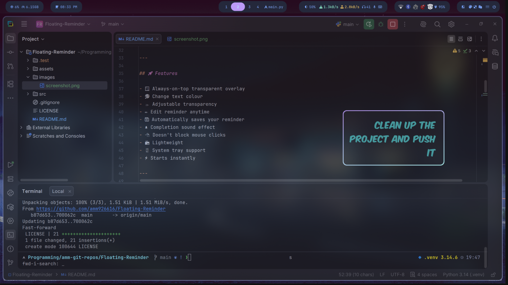

# 📝 What Matters Most

> A distraction-free floating reminder that always stays on top of your desktop.

<p align="center">
    
    
    
    
</p>

---

## 📸 Preview

<p align="center">
    
</p>

---

## ✨ Why?

Modern computers are full of distractions.

You open your browser to do one thing...

...and twenty minutes later you're watching random YouTube videos.

**What Matters Most** puts your current goal directly on your desktop, quietly reminding you what you're supposed to be doing.

No notifications.

No popups.

No alarms.

Just a constant reminder.

---

## 🚀 Features

- 🪟 Always-on-top transparent overlay
- 🎨 Change text colour
- 🌫 Adjustable transparency
- ✏ Edit reminder anytime
- 💾 Automatically saves your reminder
- 🔔 Completion sound effect
- 🖱 Doesn't block mouse clicks
- 📦 Lightweight
- 🖥 System tray support
- ⚡ Starts instantly

---

## 📷 Screenshots

### Floating Reminder


---

### Configuration


---

### System Tray


---

## 📦 Installation

Clone the repository

```bash
git clone https://github.com/YOUR_USERNAME/what-matters-most.git
```

Go into the project

```bash
cd what-matters-most
```

Install dependencies

```bash
pip install -r requirements.txt
```

Run

```bash
python main.py
```

---

## 🛠 Built With

- Python
- PySide6
- Qt Multimedia
- JSON Configuration

---

## 📂 Project Structure

## 📂 Project Structure

```text
Floating-Reminder/
│
├── assets/
│   ├── fonts/
│   │   └── KOMIKAX_.ttf
│   ├── resources/
│   │   └── icon.png
│   └── sounds/
│       └── alarm.mp3
│
├── src/
│   ├── main.py
│   ├── const.py
│   ├── create_desktop_file.py
│   └── ui/
│       ├── transparentwidget.py
│       ├── traymenu.py
│       └── configwindow.py
│
├── README.md
└── .gitignore
```

---

## 🎯 Future Ideas

- [ ] Multiple reminders
- [ ] Markdown support
- [ ] Drag anywhere on screen
- [ ] Reminder history
- [ ] Daily checklist
- [ ] Pomodoro mode
- [ ] Keyboard shortcuts
- [ ] Auto startup
- [ ] Multiple monitor support
- [ ] Theme presets

---

## ❤️ Philosophy

> Your attention is your most valuable resource.

This project exists for one simple reason:

**Keep the important thing in front of your eyes.**

---

## 🤝 Contributing

Pull requests are welcome.

If you have an idea that improves productivity without adding unnecessary complexity, feel free to open an issue.

---

## 📜 License

MIT License